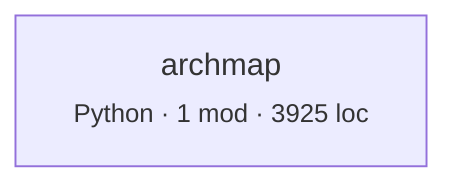
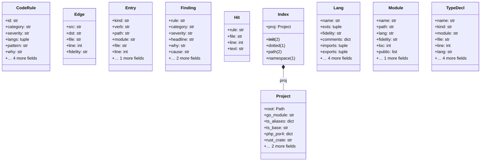

# Architecture map

Derived from source by archmap 2.0. Every line is computed, not written. Regenerate with `archmap map`; do not edit by hand.

## What this says about the system

Each item fired because a measurement crossed a threshold. The numbers and the evidence are from your code; the explanation is fixed text from a rule catalog, identical every time that rule fires on any repository. `archmap rules` prints the catalog on its own so you can audit the claims before trusting them here. What none of it can tell you is why your team built it this way — that is what `archmap adr` leaves blank.

| | count |
|---|---:|
| Notes | 1 |

### Note · No layering declared, so layer checks are off.

**Why it matters.** Cycles and coupling are measurable without knowing your intent, but 'this dependency should not exist' is not. Declaring layers is how you tell the tool what the design is supposed to be, which turns a description into a check that can fail in CI.

**What usually causes it.** Most repositories never write the layering down; it lives in review comments and in whoever has been there longest.

**What to do.** Add a `layers` map to `.archmap.json`, ordered top to bottom. Start with the layering you believe you have — the first run will tell you whether you have it.

<sub>`ARCH-NOLAYERS` · Evidence quality</sub>

## Inside the files

The section above reasons about the import graph, where an edge either exists or does not. This one reads inside files, and its evidence is weaker by construction. Python is analysed with its real grammar, so complexity, nesting, length and parameter counts are exact. Every other language is matched lexically against comment-stripped source: those rules report **the presence of a construct, not a proven defect**. There is no dataflow analysis here. A flagged line may be perfectly correct in context, and an unflagged file may still be wrong. Read these as places to look, not as a verdict.

| category | findings |
|---|---:|
| Security | 4 |
| Performance | 1 |
| Algorithms and data structures | 2 |
| Maintainability | 5 |
| Readability | 1 |

### Security

**Serious · SEC-DESERIALIZE** — 1 occurrence(s) across 1 file(s).

*Why it matters.* These formats do not merely carry data: they carry instructions for reconstructing objects, which can include running code. Deserialising untrusted input with them is equivalent to running it. No amount of validation after the fact helps, because execution happens during parsing.

*What usually causes it.* Choosing the format that round-trips native objects with least effort, often for a cache or an inter-process queue that later grew an external input.

*What to do.* Use a data-only format: JSON, or `yaml.safe_load`. Where native objects are genuinely needed, keep the channel internal and authenticated, and write down that assumption next to the call.

<details><summary>Evidence</summary>

- `archmap.py:2120` — `ObjectInputStream`

</details>

**Serious · SEC-SQLCONCAT** — 1 occurrence(s) across 1 file(s).

*Why it matters.* A query assembled by concatenation cannot distinguish the query's structure from its data, so any input that reaches it can change what the query does. Escaping by hand is not a fix; the parser rules are more complicated than the escaping usually accounts for.

*What usually causes it.* A query that started static and gained one dynamic value, most often an ORDER BY or an IN clause that parameter binding makes awkward.

*What to do.* Use parameter binding for values. Where the dynamic part is an identifier or a sort direction, validate it against an explicit allowlist, since binding cannot parameterise those.

<details><summary>Evidence</summary>

- `archmap.py:2286` — `SELECT\s+\*\s+FROM`

</details>

**Serious · SEC-TLSOFF** — 1 occurrence(s) across 1 file(s).

*Why it matters.* Disabling certificate verification removes the only thing that distinguishes the intended server from anyone on the network path. The connection is still encrypted, which is what makes this easy to miss: it looks like TLS and provides none of the authentication.

*What usually causes it.* Almost always a self-signed certificate in a development or staging environment, with the workaround shipped by accident.

*What to do.* Point the client at the correct CA bundle instead. For internal certificates, add the internal CA to the trust store rather than disabling the check.

<details><summary>Evidence</summary>

- `archmap.py:2160` — `NODE_TLS_REJECT_UNAUTHORIZED`

</details>

**Worth attention · SEC-WEAKCRYPTO** — 2 occurrence(s) across 1 file(s).

*Why it matters.* MD5 and SHA-1 have practical collision attacks, DES has an exhaustible key space, and ECB mode leaks structure because identical plaintext blocks produce identical ciphertext. Each is fine for a checksum and wrong for anything where an adversary benefits from forging or reading.

*What usually causes it.* Copied from an older example, or chosen when the use was non-security and later became security-relevant.

*What to do.* For integrity use SHA-256 or better; for passwords use argon2, scrypt, or bcrypt, never a plain hash; for encryption use AES-GCM or a library that picks the mode for you. Where the use is genuinely a non-security checksum, say so in a comment so the next reader does not have to re-derive it.

<details><summary>Evidence</summary>

- `archmap.py:2146` — `AES/ECB`
- `archmap.py:2147` — `DES`

</details>

### Performance

**Worth attention · PERF-NESTEDLOOP** — 1 occurrence(s) across 1 file(s).

*Why it matters.* Three levels of loop nesting means work proportional to the product of three collection sizes. That is fine when the inner collections are bounded and quietly catastrophic when one of them grows with data.

*What usually causes it.* An inner lookup written as a scan because the collection was small when the code was written.

*What to do.* Check what each level iterates over and which of them can grow. The usual fix is to replace the innermost scan with a dictionary or set built once outside the loops.

<details><summary>Evidence</summary>

- `archmap.py:200` — `4 levels of loop nesting`

</details>

### Algorithms and data structures

**Worth attention · ALGO-LINEARSCAN** — 1 occurrence(s) across 1 file(s).

*Why it matters.* Membership testing against a list or array is a linear scan. Inside a loop that makes the whole operation quadratic, which is the most common accidental O(n²) in ordinary application code: no algorithm was chosen, a data structure was.

*What usually causes it.* A list was the obvious container when the code was written, and membership testing was added later without revisiting the choice.

*What to do.* Build a set or dictionary once before the loop and test against that. Membership goes from linear to constant, and the change is usually one line.

<details><summary>Evidence</summary>

- `archmap.py:2013` — `.index(`

</details>

**Worth attention · ALGO-SORTLOOP** — 43 occurrence(s) across 1 file(s).

*Why it matters.* Sorting inside a loop repeats an n log n operation on data that has usually not changed, or has changed in a way that could be maintained incrementally. The total cost is a factor of n above what the work requires.

*What usually causes it.* Needing ordered data at a point inside the loop, with the sort placed where the need appears rather than where the data is produced.

*What to do.* Sort once before the loop. If the collection genuinely changes each iteration, a heap or a sorted container maintains order at log n per insertion instead of n log n per pass.

<details><summary>Evidence</summary>

- `archmap.py:345` — `sorted(`
- `archmap.py:351` — `sorted(`
- `archmap.py:549` — `sorted(`
- `archmap.py:620` — `sorted(`
- `archmap.py:635` — `sorted(`
- `archmap.py:646` — `sorted(`

</details>

### Maintainability

**Worth attention · MNT-SWALLOW** — 2 occurrence(s) across 1 file(s).

*Why it matters.* An empty handler converts a failure into a silent wrong answer. The program continues in a state its author did not anticipate, and the eventual symptom appears somewhere unrelated with no trace of the original cause. Debugging time for these is measured in days.

*What usually causes it.* A failure that was noisy and not understood, silenced to get on with the work, and never revisited.

*What to do.* Handle it, or log it with enough context to identify the case, or let it propagate. If it is genuinely expected and safe, catch the specific exception type and write a comment saying why nothing needs to happen.

<details><summary>Evidence</summary>

- `archmap.py:288` — `except Exception:                 pass`
- `archmap.py:299` — `except Exception:             pass`

</details>

**Worth attention · MNT-COMPLEX** — 27 of 80 Python functions (34%) have a cyclomatic complexity of 12 or more; the highest is 157.

*Why it matters.* Complexity counts the independent paths through a function, which is also the number of test cases needed to cover it and the number of cases a reader must hold at once. Past about ten, reviewers stop simulating the function and start trusting it, which is where defects survive review.

*What usually causes it.* Requirements added one branch at a time. No single change made the function complex.

*What to do.* Extract the branches that belong together into named functions; the names are usually already in the comments or the variable names. Guard clauses that return early remove nesting without moving logic.

<details><summary>Evidence</summary>

- `archmap.py:1320` — `evaluate` complexity 157, 695 lines, nesting 4
- `archmap.py:3426` — `render_md` complexity 71, 230 lines, nesting 3
- `archmap.py:3326` — `render_journeys` complexity 39, 98 lines, nesting 3
- `archmap.py:397` — `scan_file` complexity 38, 80 lines, nesting 6
- `archmap.py:2915` — `types_lexical` complexity 38, 83 lines, nesting 5
- `archmap.py:3789` — `main` complexity 36, 133 lines, nesting 3
- `archmap.py:2865` — `types_python` complexity 32, 48 lines, nesting 8
- `archmap.py:3096` — `render_types` complexity 30, 65 lines, nesting 2

</details>

**Minor · MNT-TODO** — 9 occurrence(s) across 1 file(s).

*Why it matters.* Markers left in code are notes to a future reader who has no way to know whether they are current. In small numbers they are useful; in large numbers they become noise that trains everyone to stop reading them, at which point the genuinely urgent ones are invisible.

*What usually causes it.* The honest reflex of flagging something rather than silently leaving it. The problem is accumulation, not the individual note.

*What to do.* Move anything real into the issue tracker where it can be prioritised and closed, and delete the rest. A marker with no owner and no date is not a plan.

<details><summary>Evidence</summary>

- `archmap.py:2401` — `TODO`
- `archmap.py:2402` — `TODO`
- `archmap.py:2402` — `FIXME`
- `archmap.py:2402` — `HACK`
- `archmap.py:2402` — `XXX`
- `archmap.py:2402` — `BUG`

</details>

**Minor · MNT-LONGFUNC** — 8 of 80 Python functions (10%) are 80 lines or longer; the longest is 695.

*Why it matters.* Length is a proxy for how much has to be understood before any part can be changed. A function that does not fit on a screen cannot be checked against its own beginning, and long functions accumulate local variables whose lifetimes overlap in ways nothing enforces.

*What usually causes it.* Sequential steps written where they occur, each addition smaller than the threshold for extracting it.

*What to do.* Extract the steps that operate on a distinct set of locals. If the extracted function needs six parameters, that group of values is a type worth naming.

<details><summary>Evidence</summary>

- `archmap.py:1320` — `evaluate`, 695 lines
- `archmap.py:3426` — `render_md`, 230 lines
- `archmap.py:3789` — `main`, 133 lines
- `archmap.py:2592` — `code_findings`, 125 lines
- `archmap.py:3326` — `render_journeys`, 98 lines
- `archmap.py:669` — `build`, 87 lines

</details>

**Minor · MNT-PARAMS** — 5 of 80 Python functions (6%) take 6 or more parameters; the largest takes 8.

*Why it matters.* A long parameter list is usually several values that travel together and have no name. Callers must remember an order, positional mistakes between same-typed parameters type-check silently, and every new requirement adds another.

*What usually causes it.* Passing context down through layers, one value at a time as each became necessary.

*What to do.* Group the parameters that always appear together into a dataclass or record. The name of that group is usually a concept the codebase was missing.

<details><summary>Evidence</summary>

- `archmap.py:1316` — `F_`, 8 parameters
- `archmap.py:3426` — `render_md`, 8 parameters
- `archmap.py:3096` — `render_types`, 7 parameters
- `archmap.py:822` — `mermaid`, 6 parameters
- `archmap.py:3038` — `class_diagram`, 6 parameters

</details>

### Readability

**Worth attention · RDB-NESTING** — 19 of 80 Python functions (24%) nest control flow 4 levels or deeper.

*Why it matters.* Each level of nesting is a condition the reader must keep true in their head for everything inside it. Depth compounds: at four levels the reader is tracking four simultaneous invariants to understand one line. Nesting correlates with defects more strongly than length does.

*What usually causes it.* Conditions added around existing code rather than in front of it, because wrapping is a smaller diff than restructuring.

*What to do.* Invert the conditions and return early, so the exceptional cases leave at the top and the main path stays at one level. Extracting the innermost block into its own function achieves the same and gives the block a name.

<details><summary>Evidence</summary>

- `archmap.py:2865` — `types_python`, depth 8
- `archmap.py:397` — `scan_file`, depth 6
- `archmap.py:3693` — `adrs`, depth 6
- `archmap.py:1160` — `abstractness`, depth 5
- `archmap.py:2427` — `loop_spans`, depth 5
- `archmap.py:2481` — `python_metrics`, depth 5

</details>

---

The rest of this document is the evidence those findings were computed from.

## Coverage

What was read, and where every import went. Third-party means the target is expected to live outside this tree. Unaccounted means an import that looks local and resolved to nothing: those are edges missing from the graph below, usually a source root or path alias this tool has not been told about.

| Language | Fidelity | Files | Imports | Internal | Third-party | Unaccounted |
|---|---|---:|---:|---:|---:|---:|
| Python | parsed | 1 | 13 | 0 | 13 | 0 |

## Shape

- 1 modules across 1 components
- 0 internal import edges, 0 component couplings
- 3925 lines
- propagation cost 0% — the share of other components an average component can reach through import paths

## Component graph



Dashed edges came from heuristic scanners. Thick borders are in a cycle. Labels count import sites.

## Ways in, and where they lead

No routes, commands, jobs, or navigation links were recognised. Either this tree has no entry points of its own, or its framework is not one this tool knows how to read.

## The nouns

10 types declared: 0 inheritance and 1 composition relationships between types defined in this tree. Relationships to types declared elsewhere are omitted rather than guessed, so this is a lower bound. 10 types were read with a real parser; the rest come from declaration syntax, which is reliable for the declaration and weaker for the member lists.

### `archmap`



## Reachability from entry points

What each root actually pulls in, to a depth of three. Nothing imports these modules, so they are where a reader has to start.

**archmap.py**

```
archmap  (Python)
```

## Coupling

| Component | Languages | Modules | LOC | Fan-in | Fan-out | Instability |
|---|---|---:|---:|---:|---:|---:|
| `archmap` | Python | 1 | 3925 | 0 | 0 | 0.0 |

Instability is fan-out / (fan-in + fan-out). A component many things depend on that itself depends widely propagates change in both directions.

## Cycles

None at component level.

## External dependencies

No third-party packages resolved outside the tree.

12 standard-library modules imported; most used: `dataclasses` (2), `__future__` (1), `argparse` (1), `ast` (1), `collections` (1), `json` (1), `os` (1), `pathlib` (1), `re` (1), `subprocess` (1), `sys` (1), `textwrap` (1).

## Churn against size

Most-changed files in the last 12 months. This is where any map you carry in your head goes stale first.

| File | Lines touched | LOC | Language |
|---|---:|---:|---|
| `archmap.py` | 3925 | 3925 | Python |

## Public surface

<details><summary><code>archmap</code> — 111 exported</summary>


_Showing 40 of 111; `--full` lists them all._


`archmap`

- class CodeRule:2076
- class Edge:315
- class Entry:3180
- class Finding:1241
- class Hit:2420
- class Index:483
- class Lang:50
- class Module:324
- class Project:255
- class TypeDecl:2783
- const ABSTRACTION_LANGS:1157
- const ABSTRACT_KINDS:1153
- const ADR_TMPL:3662
- const ALGO:2089
- const BAD_SPEC:243
- const BY_EXT:157
- const CATEGORIES:1254
- const CODE_CATEGORIES:1256
- const CODE_RULES:2092
- const CONCRETE_KINDS:1154
- const C_STYLE:45
- const DEFAULTS:159
- const FILE_ROUTED:3228
- const HASH:46
- const LANGS:63
- const MAX_CYCLE_EDGES:800
- const MAX_CYCLE_MEMBERS:799
- const MAX_NODES:798
- const MAX_SURFACE:801
- const MNT:2090
- const NAV_PATTERNS:3218
- const NODE_BUILTINS:992
- const OVERLAP_GROUPS:1207
- const PERF:2089
- const RDB:2090
- const ROUTE_PATTERNS:3190
- const RUBY_STDLIB:999
- const RULE_INDEX:1279
- const SCL:2090
- const SEC:2089

</details>

---

**Not derivable from code.** Why these boundaries were chosen, what was rejected, and what constraint each one holds. `archmap adr` scaffolds one file per decision point with the facts filled in and those questions blank.
